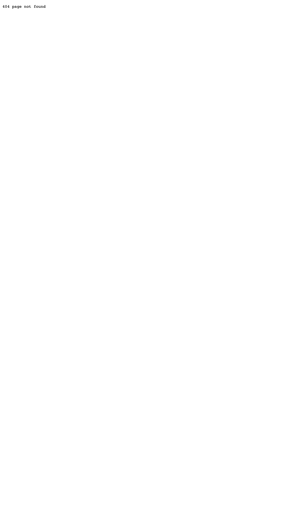
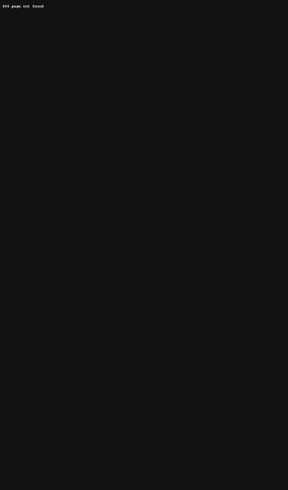

# 台灯控制

小米台灯2（xiaomi.light.lamp31）的本地命令行控制工具，通过局域网直接控制，无需云端。

## 功能特性

- **本地控制**：通过局域网 UDP 直接通信，无需云端
- **完整功能**：开关、亮度（1-100%）、色温（2700-5100K）
- **场景模式**：暖白、自然、冷白、阅读、睡前五种预设
- **状态查询**：实时获取台灯当前状态
- **零依赖**：Go 编译为单个二进制，无需安装任何运行时

## 快速开始

### 1. 配置设备信息

创建 `.env` 文件（参考 `.env.example`）：

```env
LAMP_IP=192.168.x.x
LAMP_TOKEN=your_32_char_hex_token_here
```

- `LAMP_IP`：台灯在局域网中的 IP 地址
- `LAMP_TOKEN`：设备的 32 位十六进制 token（获取方式见下文）

### 2. 编译

```bash
cd lamp
go build -o ~/bin/lamp .
```

确保 `~/bin` 在 PATH 中（在 `~/.zshenv` 或 `~/.bashrc` 中添加 `export PATH="$HOME/bin:$PATH"`）。

### 3. 使用

```bash
lamp 开
lamp 状态
lamp 自然 60
```

调试链路（打印握手、请求参数、响应）：

```bash
LAMP_DEBUG=1 lamp 自然 60
```

## 命令参考

| 命令 | 参数 | 说明 |
|------|------|------|
| `开` | 无 | 开灯 |
| `关` | 无 | 关灯 |
| `状态` | 无 | 查询当前状态 |
| `亮度` | 1-100 | 设置亮度 |
| `色温` | 2700-5100 | 设置色温（K） |
| `serve` | 可选监听地址 | 启动 Web 控制台（默认 `:8080`） |
| `暖白` | 可选亮度 | 2700K 暖白光 |
| `自然` | 可选亮度 | 4000K 自然光 |
| `冷白` | 可选亮度 | 5100K 冷白光 |
| `阅读` | 可选亮度 | 5100K 阅读模式 |
| `睡前` | 可选亮度 | 2700K 睡前模式 |

说明：场景命令默认会应用该场景预设的色温与亮度；传入亮度参数时仅覆盖亮度。

不带参数运行显示帮助：

```bash
lamp
```

## Web 控制台

启动方式：

```bash
lamp serve
```

默认监听 `:8080`，浏览器打开：

- `http://127.0.0.1:8080`

也可以指定地址：

```bash
lamp serve 0.0.0.0:8080
```

或者使用环境变量：

```bash
LAMP_WEB_ADDR=:8080 lamp serve
```

### iOS 安装为主屏幕应用（PWA）

1. 在 iPhone 的 Safari 打开 `http://<主机IP>:8080`
2. 点击分享按钮，选择“添加到主屏幕”
3. 之后可像 App 一样从主屏幕打开

### 界面预览（iPhone 13）

浅色主题：



深色主题：



## 获取设备 Token

1. 在米家 App 中将台灯连接到局域网
2. 使用 [python-miio](https://github.com/rytilahti/python-miio) 的 `miiocli` 工具或抓包工具获取 token
3. Token 为 32 位十六进制字符串

## 项目结构

```
mylamp/
├── .env                # 环境配置（不提交 Git）
├── .env.example        # 配置模板
├── lamp/               # Go 源码
│   ├── go.mod
│   ├── main.go         # CLI 入口
│   ├── miio.go         # MiIO 协议层（UDP + AES-128-CBC）
│   ├── device.go       # 台灯控制层
│   ├── web.go          # Web 服务层
│   └── web/
│       ├── index.html  # Web 控制台页面
│       ├── manifest.webmanifest
│       ├── sw.js
│       ├── icon.svg
│       ├── icon-180.png
│       └── icon-512.png
├── docs/
│   └── screenshots/
│       ├── mobile-light.png
│       └── mobile-dark.png
├── LAMP_AGENT_GUIDE.md # AI Agent 使用说明
└── README.md
```

## 技术细节

- **通信协议**：MiOT over UDP port 54321
- **加密**：AES-128-CBC，`key = MD5(token)`，`iv = MD5(key + token)`
- **全部使用 Go 标准库**：`crypto/aes`、`crypto/md5`、`encoding/json`、`net`
- **参数映射**：
  - 开关：`siid=2, piid=1`
  - 亮度：`siid=2, piid=2`（1-100）
  - 色温：`siid=2, piid=3`（2700-5100K）

## 安全注意事项

- `.env` 文件包含设备 token，**切勿提交到 Git**
- 控制仅在局域网内有效
